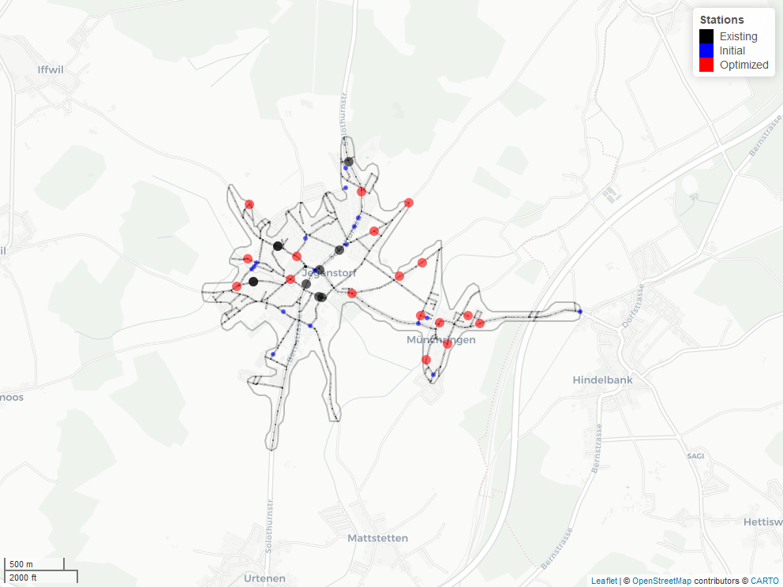

# Demand-responsive transport planner
<!-- badges: start -->
[](https://www.tidyverse.org/lifecycle/#experimental)
<!-- badges: end -->

Tool for placing virtual stations in demand-responsive transport systems in villages by defining and minimizing a global energy (`drtplanr`, name is inspired by [stplanr](https://github.com/ropensci/stplanr)). The station locations are randomly initialized in the street network and iteratively optimized based on the reachable population in combination with walking and driving times.

The configured model optimizes the positions of virtual stations in an assumed on-demand shuttle service for the community of Jegenstorf in Bern, Switzerland. 

## Getting started
First the necessary data sets (OSM cutout and STATPOP) have to be downloaded. Open a shell in the root directory of the repository and run the following lines:

``` bash
# Get STATPOP data set
mkdir -p data/statpop && cd "$_"
curl https://www.bfs.admin.ch/bfsstatic/dam/assets/9947069/master -o statpop.zip
unzip -a statpop.zip
rm statpop.zip && cd -

# Get OSM cutout
mkdir -p data/osm && cd "$_"
curl https://download.geofabrik.de/europe/switzerland-latest-free.shp.zip -o osm.zip
unzip -a osm.zip
rm osm.zip && cd -

```

Then install the required R packages:

``` r
Rscript -e 'install.packages(c("data.table", "sf", "dodgr", "osmdata"), repo="http://cran.rstudio.com/")'
Rscript -e 'install.packages(c("hereR", "ggplot2", "mapview"), repo="http://cran.rstudio.com/")'
``` 

Done!

## Run the model
If the steps described above have been successfully completed, you can run the model
by starting the R scripts in the repository root:

``` bash
Rscript 01_prepare_data.R 
Rscript 02_model_run.R  
```

|||
|---|---|

## Authors
* Merlin Unterfinger (implementation) - [munterfinger](https://github.com/munterfinger)
* Oliver Hofer (ideas and feedback) - [nebucaz](https://github.com/nebucaz)

## References
* [hereR](https://github.com/munterfinger/hereR): R interface to the HERE REST APIs 
* [geofabrik.de](https://download.geofabrik.de): OpenStreetMap data extracts
* [bfs](https://www.bfs.admin.ch/): Population data for Switzerland

## Licence
* This repository is licensed under the GNU General Public License v3.0 - see the [LICENSE](LICENSE) file for details.
