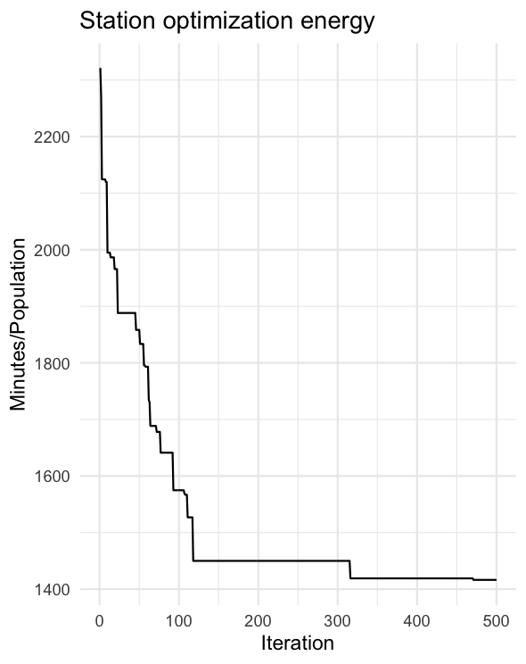
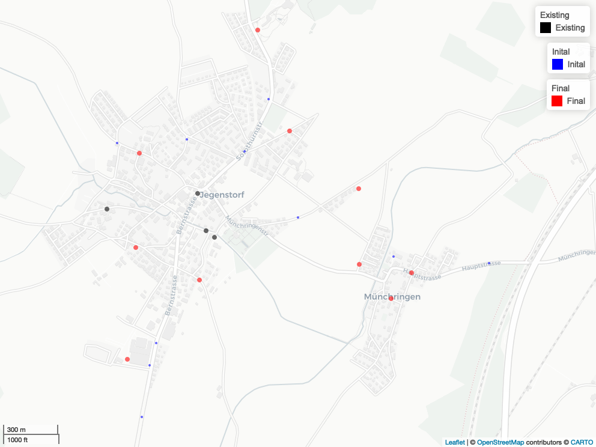

# Demand-responsive transport planner (drtplanr)

Tool for planning and optimizing virtual stations in demand-responsive transport systems (name inspired by [stplanr](https://github.com/ropensci/stplanr)).

The configured model optimizes the positions of virtual stations in an assumed on-demand service for the community of Jegenstorf in Bern, Switzerland.

## Getting started
First the necessary data sets (OSM cutout and STATPOP) have to be downloaded. Open a shell in the root directory of the repository and run the following lines:

``` bash
# Get STATPOP data set
mkdir -p data/statpop && cd "$_"
curl https://www.bfs.admin.ch/bfsstatic/dam/assets/9947069/master -o statpop.zip
unzip -a statpop.zip
rm statpop.zip && cd -

# Get OSM cutout
mkdir -p data/osm && cd "$_"
curl https://download.geofabrik.de/europe/switzerland-latest-free.shp.zip -o osm.zip
unzip -a osm.zip
rm osm.zip && cd -

```

The model requires an API key for a HERE project to access the HERE APIs for routing, public transport connections and stations. Go to [HERE Developer](https://developer.here.com/), log in or sign up and create an API key (250k request are free):

 1. Select a project
 2. click ‘*REST: Generate APP*’
 3. click ‘*Create API Key*’ and copy the key. 
 
Create a new file from this template (e.g. `vi config.json`):

``` json
{
   "here":{
      "key":"<YOUR-API-KEY>"
   },
   "proxy":{
      "url":"<YOUR-PROXY-URL>",
      "usr":"<YOUR-PROXY-USERNAME>",
      "pw":"<YOUR-PROXY-PW>"
   }
}

```

Paste the key into the new file, remove not required entries (e.g. proxy), and save the file as `"config.json"` to the the root
directory of the repository.

Finally install the required R packages:

``` r
Rscript -e 'install.packages(c("data.table", "ggplot2", "devtools", "mapview"), repo="http://cran.rstudio.com/")'
Rscript -e 'devtools::install_github("munterfinger/hereR", build_vignettes = TRUE)'

``` 

Done!

## Run the model
If the steps described above have been successfully completed, you can run the model
by starting the R scripts in the root repository:

``` bash
Rscript 01_prepare_data.R 
Rscript 02_model_setup.R
Rscript 03_model_run.R  
Rscript 04_plot_result.R 
```

|||
|---|---|

## Authors
* Merlin Unterfinger (implementation) - [munterfinger](https://github.com/munterfinger)
* Oliver Hofer (ideas and feedback) - [nebucaz](https://github.com/nebucaz)

## References
* [hereR](https://github.com/munterfinger/hereR): R interface to the HERE REST APIs 
* [geofabrik.de](https://download.geofabrik.de): OpenStreetMap data extracts
* [bfs](https://www.bfs.admin.ch/): Population data for Switzerland

## Licence
* This repository is licensed under the GNU General Public License v3.0 - see the [LICENSE](LICENSE) file for details.