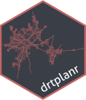

# Demand-responsive transport planner 
<!-- badges: start -->
[](https://www.tidyverse.org/lifecycle/#experimental)
[](https://github.com/munterfinger/drtplanr/actions)
[](https://github.com/munterfinger/drtplanr/actions)
[](https://codecov.io/gh/munterfinger/drtplanr?branch=master)
<!-- badges: end -->

Tool for placing virtual stations in demand-responsive transport systems in villages by defining and minimizing a global energy (`drtplanr`, name is inspired by [stplanr](https://github.com/ropensci/stplanr)). The station locations are randomly initialized in the street network and iteratively optimized based on the reachable population in combination with walking and driving times.

The model in the package example optimizes the positions of virtual stations in an assumed on-demand shuttle service for the community of Jegenstorf in Bern, Switzerland.

|||
|---|---|

## Getting started
Install the development version from [GitHub](https://github.com/munterfinger/drtplanr/) with:

``` r
remotes::install_github("munterfinger/drtplanr")
```

### Load example data
Load the package example data sets of a village in Switzerland:

* `aoi`: Area of Interest - 3 min driving time isochrone around the station of Jegenstorf, Bern.
* `pop`: Centroids of population and structural business hectare grid statistis, where the variable 'n' is the sum of full-time equivalence jobs and residents per hectare (BfS).

``` r
aoi <-
  sf::st_read(system.file("example.gpkg", package="drtplanr"), layer = "aoi")

pop <-
  sf::st_read(system.file("example.gpkg", package="drtplanr"), layer = "pop")
```

To create the datasets for a different region in Switzerland use the
[create.sh](https://github.com/munterfinger/drtplanr/blob/master/data-raw/create.sh)
and adjust the geocoded address:
``` r
./create.sh -k <YOUR HERE API KEY>
```
**Note:** A HERE API key is required and has to be passed as with the option `-k`.

### Run a model
Create a new demand reponsive transport model for the aoi 'Jegenstorf', with 10 randomly initialized virtual on-demand stations.
``` r
m <- drt_drtm(
  model_name = "Jegenstorf",  # Name of the drtm (used when exporting the model)
  aoi = aoi,                  # Area of interest (sf with geometry type POLYGON)
  pop = pop,                  # Population layer (sf with geometry type POINT)
  n_vir = 15,                 # Number of virtual stations to place (numeric)
  m_seg = 100                 # Resolution of the segments on the street network
)
```

Iterate the model 100 times, where every iteration consists of:

1. Relocate a virtual station randomly on the road segments.
2. Calculate the new global energy of the model using the routing graphs.
3. If the energy is lower than previuos iteration: Keep the new location of the virtual station; otherwise: Reset to the previous location.

``` r
m1 <- drt_iterate(m, 100)
```

### Visualize results
Plot the energy optimization curve and the station map of the model: 
``` r
drt_plot(m)                 # Energy plot showing progress of iterations
drt_map(m)                  # Map with the inital and final station locations
```

## Authors
* Merlin Unterfinger (implementation) - [munterfinger](https://github.com/munterfinger)
* Oliver Hofer (ideas and feedback) - [nebucaz](https://github.com/nebucaz)

## References
* [hereR](https://github.com/munterfinger/hereR): R interface to the HERE REST APIs
* [BfS](https://www.bfs.admin.ch/): Population data for Switzerland
* [OSM](https://www.openstreetmap.org/): Street network data for routing purposes.

## Licence
* This repository is licensed under the GNU General Public License v3.0 - see the [LICENSE.md](LICENSE.md) file for details.
